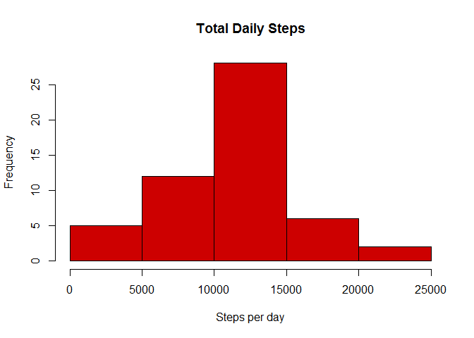
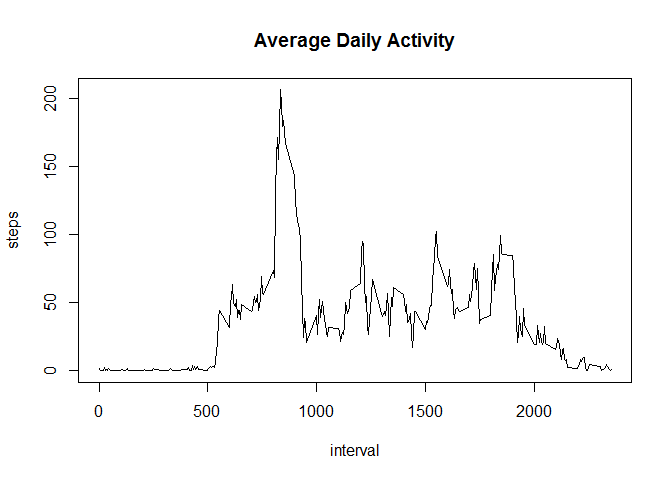
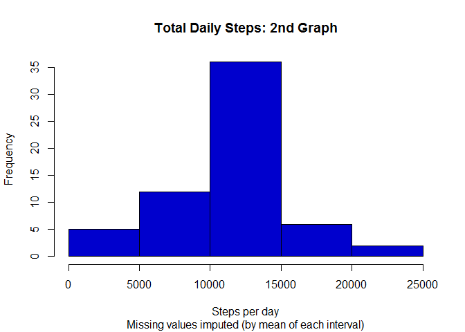
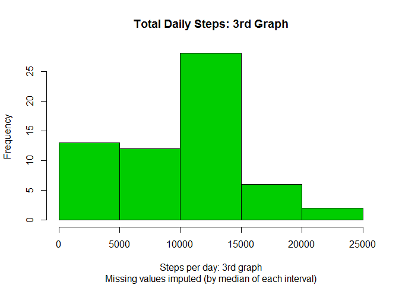
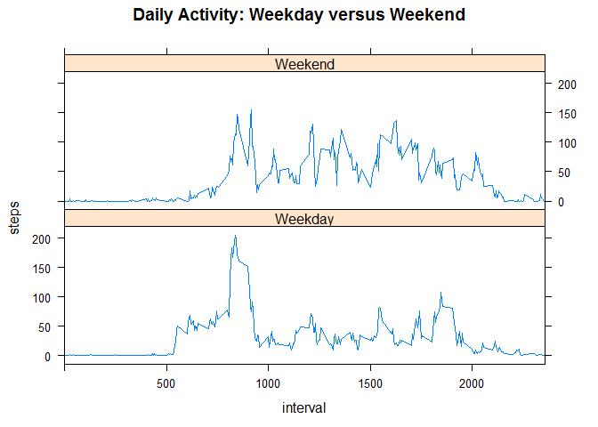

# Reproducible Research: Peer Assessment 1
## Data

**To graders:** *After I submitted the assignment, I added a further explanation about two strategies I employed for imputing missing data. You can find this extra part at the end of the relevant section. The extra explanation was not part of the required assignment so if you wish please ignore the latest version of files and look for the commit marked as "final edit"- the version corresponds with my submitted SHA-1 and although was pushed slightly after 11:30 deadline (I was working on the assignment until last minute) but was still accepted by the submission page so I hope you would find it acceptable to grade too.*

The data consists of two months of data from an anonymous individual collected by a personal activity monitoring device during the months of October and November, 2012 and include the number of steps taken in 5 minute intervals each day.  

The variables included in this dataset are:  

**steps:** Number of steps taking in a 5-minute interval (missing values are coded as NA)

**date:** The date on which the measurement was taken in YYYY-MM-DD format

**interval:** Identifier for the 5-minute interval in which measurement was taken. 

*_Note:_ The interval identifier is an integer which corresponds with the hour and the minute when a particular interval begins (i.e in hh:mm format 5 identifies an interval beginning at 00:05 and 500 identifies an interval beginning at 05:00)*

The dataset is stored in a comma-separated-value (CSV) file and there are a total of 17,568 observations in this dataset.

## Loading and preprocessing the data

The GitHub repository for this assignment contains the dataset for this analysis. Hoewever to ensure reproducibility a code to download and expand the data is included in this document.


```r
if(!file.exists("activity.csv")){
        fileurl <- "https://d396qusza40orc.cloudfront.net/repdata%2Fdata%2Factivity.zip"
        temp <- tempfile()
        download.file(fileurl, temp)
        unzip(temp)
        remove(temp)
}
```

Read the dataset:


```r
dat <- read.csv("activity.csv")
```

Convert date variable to object with Date class:


```r
dat$date <- as.Date(dat$date)
```

## What is mean total number of steps taken per day?

Calculate the total number steps taken per day:


```r
dailysteps <- aggregate(steps ~ date, data = dat, sum)
```

Make a historgram plot of total number of steps taken each day:


```r
hist(x= dailysteps$steps, xlab = "Steps per day",
        main = "Total Daily Steps", col = "red3")
```

 

Calculate and report the mean of the total number of steps taken per day:  


```r
mean(dailysteps$steps, na.rm = TRUE)
```

```
## [1] 10766.19
```

Calculate and report the median of the total number of steps taken per day:  

```r
median(dailysteps$steps, na.rm = TRUE)
```

```
## [1] 10765
```

## What is the average daily activity pattern?

Make a time series plot of the 5-minute intervals and the average number of steps taken, averaged across all days:


```r
interval_steps <- aggregate(steps ~ interval, data = dat, mean)
plot(interval_steps, type = "l", 
        xlab = "interval", main = "Average Daily Activity")
```

 

*_Note:_ The interval identifier is an integer which corresponds with the hour and the minute when a particular interval begins (i.e in hh:mm format 5 identifies an interval beginning at 00:05 and 500 identifies an interval beginning at 05:00)*

Identify the 5-minute interval which contains the maximum number of steps on average across all days:


```r
max_interval <- interval_steps[which.max(interval_steps$steps), 1 ]
```

Convert the interval identifier to a human-readable timestap corresponding with the time of day when the active 5-minute period starts:


```r
max_hour <- sprintf("%02g", as.integer(max_interval/100))
max_minutes <- sprintf("%02g", ((max_interval / 100 - as.integer(max_interval/100)) * 100))
max_time <- paste(max_hour, max_minutes, sep=":")
```

The interval identifer 835 corresponds to the 5-minute period which begins at 08:35 and has the maximum number of steps by average across all days.

*Note: the above information was last evaluated at 2015-11-16 02:29:11 while this document has been processed.*


## Imputing missing values

Calculate and report the total number of missing values in the dataset:


```r
sum(is.na(dat))
```

```
## [1] 2304
```


*Note: The instruction for the assignment looks a bit confusing as it first asks for the number of missing values in the dataset and then in the explanation asks for the number of rows with 'NA's. The latter could have been less than the former if there were more than one 'NA' in a single row but that's not the case in this particular dataset.*


Create a new dataset that is equal to the original dataset but with the missing data filled in:


```r
dat2 <- dat
dat2$steps <- ifelse(is.na(dat2$steps),
                     interval_steps$steps
                     [match(dat2$interval, interval_steps$interval)],
                     dat2$steps)
```

*Note: To fill the missing values where number of steps for a particular row is not available we need a representative number. In this assignment we use the average of steps taken in each interval, averaged across all days. However we used both mean and median of each interval to calculate the average and replace the missing values to give us a reference point for comparing the effect of different strategies.*

Make a histogram of the total number of steps taken each day:


```r
dailysteps2 <- aggregate(steps ~ date, data = dat2, sum)
hist(x= dailysteps2$steps, xlab = "Steps per day", 
     sub = "Missing values imputed (by mean of each interval)",
     main = "Total Daily Steps: 2nd Graph", col = "blue3")
```

 

Calculate and report the mean total number of steps taken per day:


```r
mean(dailysteps2$steps)
```

```
## [1] 10766.19
```

Calculate and report the median total number of steps taken per day:
 

```r
median(dailysteps2$steps)
```

```
## [1] 10766.19
```

The strategy to fill the missing values with the mean for each interval has kept the mean of the result exactly the same as the original dataset and the new median is only slightly higher (and equals the mean). Also as it's evident from the new histogram the distribution of the data remains the same.  

Alternatively if we decide to use the median of each interval to fill the missing values, it affects the shape of the histogram and as a result both mean and median of total daily steps will change.

For comparison, let's calculate the median of steps for each interval, across all days in the dataset:


```r
alt_value <- aggregate(steps ~ interval, data = dat, median)
```

Now we use this alternative value to fill the missing values:


```r
dat3 <- dat
dat3$steps <- ifelse(is.na(dat3$steps), alt_value$steps
                    [match(dat3$interval, alt_value$interval)], 
                    dat3$steps)
```


Let's make a histogram of the total number of steps taken each day, but adjusted by median rather than mean:


```r
dailysteps3 <- aggregate(steps ~ date, data = dat3, sum)
hist(x= dailysteps3$steps, xlab = "Steps per day: 3rd graph", 
     sub = "Missing values imputed (by median of each interval)", 
     main = "Total Daily Steps: 3rd Graph", col = "green3")
```

 

Calculate and report the mean total number of steps taken per day:


```r
mean(dailysteps3$steps)
```

```
## [1] 9503.869
```

Calculate and report the median total number of steps taken per day:
 

```r
median(dailysteps3$steps)
```

```
## [1] 10395
```

New values for both mean and median of the total daily steps are significantly lower than the ones under previous strategy or from the original dataset. Also the frequency of the first bin in histogram has signficantly increased.

As the change in the shape of the histogram and values of mean and median shows, the selected strategy for filling `NA`s has a noticable effect on the analysis.

In order to explain the difference in results of the two types of "average" values we used to replace `NA`s, we can take a look at their five point summaries.

First let's take a look at the mean number of steps per intervals:


```r
summary(interval_steps$steps)
```

```
##    Min. 1st Qu.  Median    Mean 3rd Qu.    Max. 
##   0.000   2.486  34.110  37.380  52.830 206.200
```

Now let's compare it to the median number of steps per intervals:


```r
summary(alt_value$steps)
```

```
##    Min. 1st Qu.  Median    Mean 3rd Qu.    Max. 
##   0.000   0.000   0.000   3.962   0.000  60.000
```

As we can see the range of mean for steps per intervals is much wider than the median. Also it seems for most of intervals the median number of steps across all days is zero. In total the median number of steps for 235 intervals is zero.

This is not surprising since the data is collected from the activities of one individual who most likely in majority of the 5-minute intervals may not have taken a single step. 

In total the number of steps in 11014 intervals is equal to zero. That is 72.1567086% of observations excluding missing data.

The high frequency of 0's in the dataset makes the result of the imputing strategies very different depending on whether mean or median of steps per interval has been employed.

For the rest of the assignment, we use the version of dataset where the missing data were replaced by median steps per each interval.

## Are there differences in activity patterns between weekdays and weekends?

Create a new factor variable in the dataset with two levels - "weekday" and "weekend" indicating whether a given date is a weekday or weekend day:


```r
datwd <- ifelse(weekdays(dat3$date) %in% c("Saturday","Sunday"), "Weekend", "Weekday")
dat3$wd <- as.factor(datwd)
```

Make a panel plot containing a time series plot of the 5-minute interval and the average number of steps taken, averaged across all weekday days or weekend days:


```r
library(lattice)

interval_steps2 <- aggregate(steps ~ interval + wd, dat3, mean)

xyplot(steps ~ interval | wd, data = interval_steps2, type = "l", 
       layout = c(1, 2), main = "Daily Activity: Weekday versus Weekend",
       xlab = "interval", xlim = c(0:2355, by = 5))
```

 

As demonstrated in the above panel plot the pattern of activities during the weekends is significantly different to the pattern during the weekdays- in an average weekday the number of steps after reaching the peak in the morning drops sharply and remains low during the office hours until it rises slightly during the lunch time and again in late afternoon. But the peaks of activity during an average weekend are more distributed.  
  
    
      
      
      
      
      
##
